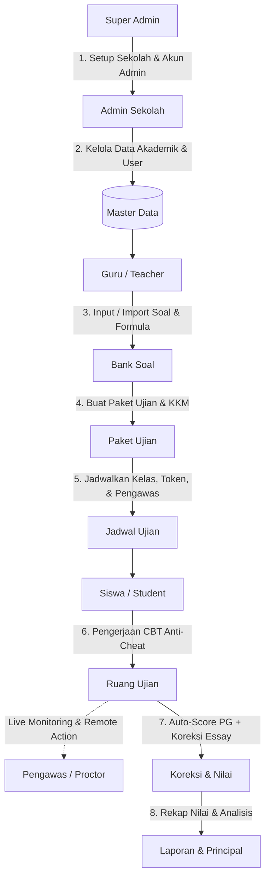

# 🎓 Sistem Ujian Online Sagaya (CBT)

<p align="center">
  
</p>

<p align="center">
  <strong>Aplikasi Ujian Berbasis Komputer (Computer-Based Testing) Modern, Aman, dan Skalabel</strong>
</p>

<p align="center">
  
  
  
  
  
  
</p>

---

## 📌 Gambaran Umum (Overview)

**Sistem Ujian Online Sagaya** adalah platform Computer-Based Test (CBT) enterprise yang dirancang untuk sekolah tingkat SMP, SMA/SMK, hingga multi-tenant institution. Sistem ini mengutamakan **integritas keamanan ujian (anti-cheating)**, fleksibilitas manajemen butir soal (formula matematika LaTeX, stimulus, upload media, Word & Excel parser), serta otomatisasi alur dari pembuatan jadwal hingga rekapitulasi nilai akhir.

---

## 🌟 Fitur Unggulan

| Modul | Deskripsi & Kemampuan |
| :--- | :--- |
| **👥 Multi-Role & RBAC** | 6 Role dengan permission terisolasi: `Super Admin`, `Admin Sekolah`, `Guru (Teacher)`, `Pengawas (Proctor)`, `Siswa (Student)`, dan `Kepala Sekolah (Principal)`. |
| **📚 Bank Soal & Formula** | Pilihan Ganda (A–E), Uraian (Essay), Shared Stimulus / Bacaan, Integrasi LaTeX (**KaTeX**) untuk rumus matematika & sains, serta upload ilustrasi. |
| **📥 Importer Massal** | Parser dokumen **Microsoft Word (.docx)** dan spreadsheet **Excel (.xlsx)** otomatis untuk migrasi soal cepat. |
| **🛡️ Anti-Cheating Suite** | Fullscreen Enforcer, deteksi tab-switch/blur window, blokir copy-paste, heartbeat ping, dan pencegahan multi-login concurrent. |
| **🖥️ Live Proctoring** | Dashboard pengawas real-time: lock/unlock attempt, force submit, reset attempt, tandai siswa absen, dan rekam jejak log pelanggaran. |
| **📊 Penilaian & Laporan** | Auto-scoring pilihan ganda instan, antarmuka koreksi manual essay bagi guru, rekapitulasi nilai kelas/mapel, cetak kartu ujian, dan export data Excel. |
| **🔒 Keamanan Data** | Isolasi data multi-sekolah dengan **PostgreSQL Row Level Security (RLS)** berbasis tenant dan session auth. |

---

## 🏛️ Alur Kerja Sistem (System Workflow)



---

## 📂 Struktur Direktori Proyek

```text
sistem-ujian-online-sagaya/
├── .github/                    # CI/CD Workflows, Issue & PR Templates
├── database/
│   └── supabase/
│       └── migrations/         # 38 file migrasi database SQL (RLS & Schema)
├── docs/                       # Dokumentasi arsitektur, panduan operasional & audit
├── public/                     # Static assets (logo, font, favicon)
├── scripts/                    # Utility scripts (env check, demo seed, reset)
├── src/
│   ├── app/                    # Next.js App Router (Routes per role & API)
│   ├── components/             # Reusable UI & Layout Components
│   ├── constants/              # App menu & label constants
│   ├── features/               # Modul domain (exam-room, question-bank, master-data, etc.)
│   ├── hooks/                  # Custom React Hooks
│   ├── lib/                    # Supabase SSR clients, auth matrix, date-time, utils
│   ├── proxy.ts                # Next.js 16 Edge Proxy / Middleware
│   └── types/                  # TypeScript interfaces & types
├── .editorconfig               # Editor code formatting standard
├── .env.example                # Template konfigurasi environment variable
├── .gitignore                  # Git ignore rules (aman dari kebocoran secret)
├── CONTRIBUTING.md             # Panduan kontribusi & commit standard
├── LICENSE                     # Lisensi open-source (MIT)
├── package.json
└── README.md
```

---

## 🚀 Panduan Memulai (Quick Start)

### 1. Kloning Repositori
```bash
git clone https://github.com/username/sistem-ujian-online-sagaya.git
cd sistem-ujian-online-sagaya
```

### 2. Pasang Dependensi
```bash
npm install
```

### 3. Konfigurasi Environment Variable
Salin `.env.example` menjadi `.env.local`:
```bash
cp .env.example .env.local
```
Sesuaikan nilainya dengan kredensial Supabase Anda:
```env
NEXT_PUBLIC_SUPABASE_URL=https://<your-project-ref>.supabase.co
NEXT_PUBLIC_SUPABASE_ANON_KEY=<your-anon-key>
SUPABASE_SERVICE_ROLE_KEY=<your-service-role-key>

DEMO_ENABLED=false
```

### 4. Setup Database & Storage Supabase
Eksekusi migrasi database ke proyek Supabase:
```bash
npm run supabase:link
npm run supabase:db:push
```
> **Penting**: Buat Storage Bucket bernama `question-media` di Supabase Dashboard dengan akses **Public Read**.

### 5. Jalankan Aplikasi
```bash
npm run dev
```
Buka browser di [http://localhost:3000](http://localhost:3000).

---

## 🧪 Validasi Kualitas Kode & CI/CD

Proyek ini telah dilengkapi dengan **Quality Gate CI Pipeline** otomatis:

```bash
# Validasi environment
npm run check:env

# Validasi linter
npm run lint

# Validasi tipe data TypeScript
npx tsc --noEmit

# Validasi production build
npm run build
```

---

## 🤝 Kontribusi & Standar Kode
Silakan baca [CONTRIBUTING.md](CONTRIBUTING.md) untuk konvensi branching, commit messages (Conventional Commits), dan alur pembuatan Pull Request.

---

## 📄 Lisensi
Proyek ini dilisensikan di bawah [MIT License](LICENSE).
